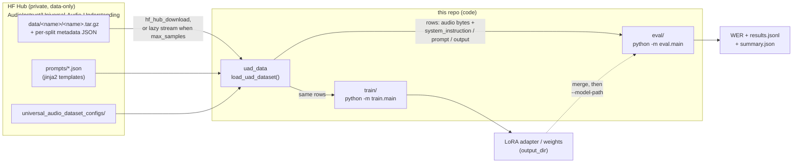

# universal_audio_instruct

Tooling for the **Universal Audio Understanding** audio-instruction benchmark:
loading the dataset, evaluating models on it, and (in progress) finetuning models
against it.

The dataset itself lives in a separate, private HuggingFace repo
([`AudioInstruct/Universal-Audio-Understanding`](https://huggingface.co/datasets/AudioInstruct/Universal-Audio-Understanding))
— this repo is the code. The dataset is loaded as plain data via `huggingface_hub`
(no `trust_remote_code` loading script); see [`MIGRATION.md`](./MIGRATION.md).

## Layout

```
uad_data/     # shared dataset library: load_uad_dataset() downloads + expands rows
eval/         # evaluation harness (batched inference + metrics)   -> python -m eval.main
train/        # QLoRA finetuning via HF Trainer                     -> python -m train.main
configs/      # dataset run configs (which datasets/tasks/splits)   e.g. clotho_config.json
tests/        # offline tests
```

Both `eval/` and `train/` consume the same `uad_data` loader, so evaluation and
training see identical rows.

## How it fits together



No code is downloaded or executed from the Hub (`trust_remote_code` is gone);
`uad_data` fetches only plain data files and expands each audio clip into
`(task × prompt-template)` rows locally.

## Quickstart (evaluation)

```bash
pip install -r requirements.txt
export HF_TOKEN=...            # dataset + gated models are private
python -m eval.main --model GEMMA-4 --json-config configs/clotho_config.json --split test
```

Or use the Colab notebook: [`eval/colab_eval.ipynb`](./eval/colab_eval.ipynb).

## Loading the dataset directly

```python
from uad_data import load_uad_dataset

rows = load_uad_dataset(
    json_config_path="configs/clotho_config.json",   # local path or a name under the repo's universal_audio_dataset_configs/
    split="test",
    repo_id="AudioInstruct/Universal-Audio-Understanding",
    token="hf_...",           # private dataset
    max_samples=None,         # cap the number of rows; stops iterating early
    # stream=None,            # lazily stream archives (auto-on when max_samples set) so a
    #                         # small cap downloads only the archive prefix, not the whole tar
)
# each row: audio (bytes), system_instruction, prompt, output, task, originating_dataset, split
```

## Finetuning

```bash
pip install -r requirements.txt -r train/requirements.txt
python -m train.main --model GEMMA-4 --json-config configs/clotho_config.json --split train
```

HF `Trainer`-based, one training backend per model (Gemma, Qwen3-Omni)
mirroring the eval backends. Three modes: QLoRA (default), LoRA on a bf16 base
(`--no-4bit`), full finetune (`--no-4bit --no-lora`). **Full guide:
[`FINETUNING.md`](./FINETUNING.md).**

## Tests

```bash
python tests/test_loader.py        # offline; needs datasets, jinja2, huggingface_hub
```
