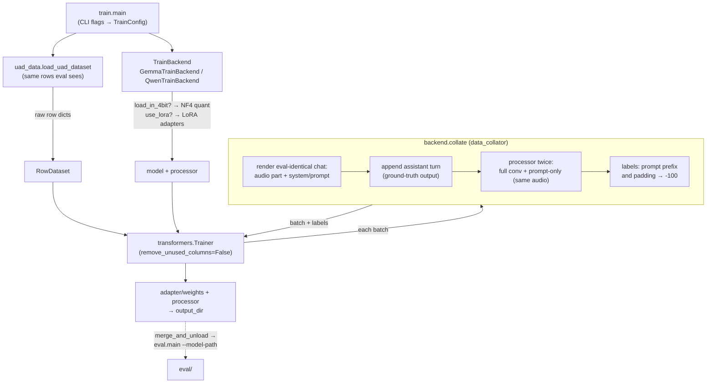

# train — finetuning

Finetuning of audio-instruction models (Gemma, Qwen3-Omni) on the Universal
Audio Understanding dataset via the HuggingFace `Trainer` API. Sibling to
[`eval/`](../eval); both reuse the shared [`uad_data`](../uad_data) loader, so
training and evaluation see identical rows.

Three modes — **QLoRA** (default), **LoRA** on a bf16 base (`--no-4bit`), and
**full finetune** (`--no-4bit --no-lora`).

```bash
pip install -r requirements.txt -r train/requirements.txt
export HF_TOKEN=...

# smoke test
python -m train.main --model GEMMA-4 --max-samples 32 --epochs 1

# real run (Gemma: LoRA on bf16 is the recommended default)
python -m train.main --model GEMMA-4 --no-4bit \
    --json-config configs/clotho_config.json --split train \
    --output-dir outputs/gemma_clotho_lora
```

## Flow



**Full guide — modes, CLI reference, label masking, evaluating a finetuned
model, troubleshooting: [`FINETUNING.md`](../FINETUNING.md).**
